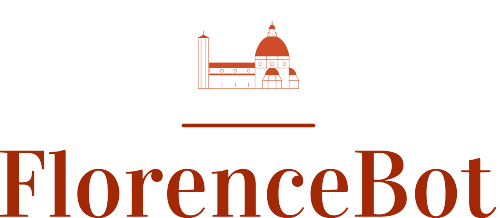
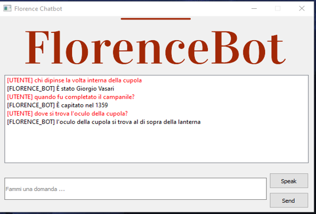

# FlorenceBot

<div id="top"></div>

<!-- PROJECT LOGO -->
<br />
<div align="center">
    
  </a>

  <h3 align="center">A fully interactive domain-specific chatbot implemented using Prolog and PySwip.</h3>

  <h3 align="center">
    <br />
    <a href="img/demo_video.mp4">View Demo</a>
  </h3>
</div>


<!--- TABLE OF CONTENTS  --->
<details>
  <summary>Table of Contents</summary>
  <ol>
    <li>
      <a href="#about-the-project">About The Project</a>
      <ul>
        <li><a href="#built-with">Built With</a></li>
      </ul>
    </li>
    <li>
      <a href="#getting-started">Getting Started</a>
      <ul>
        <li><a href="#prerequisites">Prerequisites</a></li>
        <li><a href="#installation-and-usage">Installation and usage</a></li>
      </ul>
    </li>
    <li><a href="#roadmap">Roadmap</a></li>
    <li><a href="#contributing">Contributing</a></li>
    <li><a href="#contacts">Contacts</a></li>
    <li><a href="#acknowledgments">Acknowledgments</a></li>
  </ol>
</details>


<!-- ABOUT THE PROJECT -->
## About The Project
A chatbot is basically software that simulates and processes written and spoken human conversations, allowing users to interact with digital devices as if they were communicating with a real person. The proposed work is **FlorenceBOT**, a chatbot implemented using python and pyswip. The knowledge of this chatbot is domain-specific and it regards the [Cathedral of Santa Maria del Fiore](https://duomo.firenze.it/en/discover/cathedral) in Florence.

More specific, we provide a software with a UI that allows the user to write (or speak) the question about the specific topic, and read the answer (or listen) almost instantaneously.
According to [this paper](https://www.researchgate.net/publication/331746678_A_Survey_on_Conversational_AgentsChatbots_Classification_and_Design_Techniques), this chatbot can be classified as:
* **Fully intercative**: because it is both text and speech based;
* **Task-Oriented**: because it helps the user to acquire knowledge;
* **Rule-based**: because it does not rely on a ML technique, but instead it is based on Prolog rules;
* **Domain-specific**: FlorenceBot has knowledge base about Santa Maria del Fiore.

<p align="center" width="100%">
     
</p>

_For a video demo, please look at [this](img/demo_video.mp4) file_

### Built With

This section lists any major frameworks/libraries used in this project.

* [PySwip](https://github.com/yuce/pyswip) (v. 0.2.10)
* [Spacy](https://spacy.io/) (v. 3.0.6)
* [NLTK](https://www.nltk.org/) (v. 3.6.2)
* [PyQt5](https://github.com/PyQt5) (v. 5.15.4)
* [gTTs](https://github.com/pndurette/gTTS) (v. 2.2.4)

_For more details, please read the [requirements.txt](/requirements.txt) file_

<p align="right">(<a href="#top">back to top</a>)</p>


<!-- GETTING STARTED -->
## Getting Started

To get your system up and running, follow these simple steps.

### Prerequisites
You need and environment with python 3.6.16. This is needed to install particular packages versions.

### Installation and Usage
1. As described in  the ```requirements.txt``` file, you should install all the listed packages with the correct version.
2. After that, to let the spacy nlp module work properly, it is needed an additional language module installation:
    ```sh
     python -m spacy download it_core_news_lg
    ```
3. Lastly, to let pyswip work correctly, you need to install SWI-Prolog from the [official website](https://www.swi-prolog.org/download/stable/bin/swipl-8.4.2-1.x64.exe.envelope).

4. Finally, if everything has been installed and set up correctly, you should be able to run the chatbot:
    ```sh
    python ./main.py
    ```

<p align="right">(<a href="#top">back to top</a>)</p>

<!-- ROADMAP -->
## Roadmap
These are some of the features we would like to add to this project.

- [x] Add text-to-speech module
- [ ] Make the chatbot able to reply to greetings
- [ ] Let the IRS to check on web for additional related images

<p align="right">(<a href="#top">back to top</a>)</p>


<!-- CONTRIBUTING -->
## Contributing

Contributions are what make the open source community such an amazing place to learn, inspire, and create. Any contributions you make are **greatly appreciated**.

If you have a suggestion that would make this better, please fork the repo and create a pull request. You can also simply open an issue with the tag "enhancement".
Don't forget to give the project a star! Thanks again!

<p align="right">(<a href="#top">back to top</a>)</p>

<!-- CONTACT -->
## Contacts

* Andrea Lombardi - [Linkedin](https://www.linkedin.com/in/andrea-lombardi/)
* Vincenzo Silvio - [Linkedin](https://www.linkedin.com/in/vincenzo-silvio-0413321b8/)

<p align="right">(<a href="#top">back to top</a>)</p>


<!-- ACKNOWLEDGMENTS -->
## Acknowledgments
This space lists all the helpful resources we would like to give credit to.

* Thanks to [this repo](https://github.com/BesTeam-ing/AI-2021), taken as an example baseline from which we developed our system.
* Thanks also to _[Cultural Stories Web Language - Un Formalismo per rappresentare le storie culturali nel Web](http://smcm.isasi.cnr.it/lab/cswl-un-formalismo-per-rappresentare-storie-culturali-nel-web/)_

<p align="right">(<a href="#top">back to top</a>)</p>


<!-- MARKDOWN LINKS & IMAGES -->
<!-- https://www.markdownguide.org/basic-syntax/#reference-style-links -->
[product-screenshot]: images/screenshot.png
